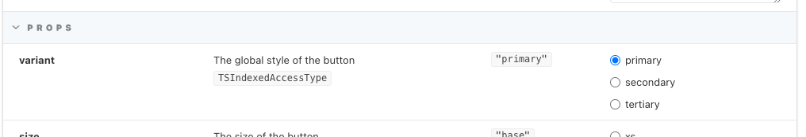
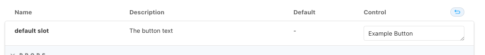

# 📄 Writing Storybook stories
This library uses [Storybook](https://storybook.js.org) for displaying all variants of a component and for providing interactive examples for users to play around with.

When creating a component with `npm run create-component ComponentName` a Storybook stories file is automatically created. This will be the primary way to develop and check the component you are creating.

First, start Storybook with
```
npm run storybook
```
and open up [localhost:6006](http://localhost:6006) to view a live reloading local version of Storybook.

## Interactivity with props
By default, the created stories file has one story: `Example`. This story should always be present. The intention is that it is used for an interactive example with Storybooks `args` feature, while the other stories simply show different states of the component.

On the `Example` story, all the available props should be added, even the ones that are not mandatory. For example, here are the ones for the button:
```ts
Example.args = {
  variant: "primary",
  size: "base",
  rounded: false,
  // more props
};
```

This way, Storybook can infer the types from the given arguments, and will correctly populate the provided field controls.

In some cases, it might be needed to set which control type Storybook will show. For example, the button variant is actually limited to `"primary"|"secondary"|"tertiary"`. This can be achieved by adding the control type to the `argTypes`, of which an empty object is added to the top of the stories file in the `export default`:

```ts{5-9}
export default {
  title: "Common/BccButton",
  component: BccButton,
  argTypes: {
    variant: {
      description: "The global style of the button",
      options: ["primary", "secondary", "tertiary"],
      control: { type: "radio" },
    },
    // more arg types
  }
}
```

This will render three radio inputs with the provided options. As you can see, a `description` can also be added, which can be a good idea sometimes to clarify what the slot should hold.

::: details Example

:::

### Adding slots to interactive examples
Storybook doesn't have great support for Vue slots by default. It will show the available slots, but it is impossible to set what type of content should go in there. Therefore, it is best to add an extra `arg` to the story, and render those contents in the slot.

```ts{3,10-13}
Example.args = {
  // ...
  slotDefault: "Example Button",
};

export default {
  // ...
  argTypes: {
    // ...
    slotDefault: {
      name: "default slot",
      description: "The button text",
    },
  },
}
```

This will render a nice text field where the user can edit the slot contents.

::: details Example

:::

### Custom code example
For interactive stories Storybook often does a bad job at representing the code example. Other stories just display the string from the file (thus always being exactly what's rendered), but for interactive stories some processing is going on.

The solution is to include a custom code example. A small downside is that this needs to be kept up-to-date along with the actual used code, but since the interactive examples are often not representative for how the component should actually be used this is a worthwhile tradeoff.

To render a custom code example, include a `parameters` block:

```js
Example.parameters = {
  docs: {
    source: {
      language: "html",
      code: `
<BccButton :icon="SearchIcon">
  Example Button
</BccButton>
    `,
    },
  },
};
```

This example should include things like `v-model` that might for various reasons not always be used in the actual code of the Example story.

## Other stories
Besides the `Example` story, all the other stories should be a simple as possible. This way it is easy to add or edit them. In general, you should try to show all the different states of a component with stories. Often, it is nice to create a story for each prop.

::: tip
As a story is just a Vue `template`, you can use any HTML in it. Utilize CSS to nicely arrange your stories.
:::

Example story for a certain prop:
```ts
export const Disabled: StoryFn<typeof BccButton> = () => ({
  components: { BccButton },
  template: `
    <div class="flex items-start space-x-2">
      <BccButton variant="primary" :disabled="true">Primary disabled</BccButton>
      <BccButton variant="secondary" :disabled="true">Secondary disabled</BccButton>
      <BccButton variant="tertiary" :disabled="true">Tertiary disabled</BccButton>
    </div>
  `,
});
```

## Common errors
### Passing icon as a prop
It's common that a component has an icon prop that can be passed as component instance. Doing this directly in the Storybook story will lead to an error in Storybook when viewing the code, even though the story will render:
```ts
Example.args = {
  // ❌ Don't do this
  icon: SearchIcon,
};
```

Instead, return the icon in the `setup()` method of the story, and set the prop manually:

```ts
const Template: StoryFn<...> = (args) => ({
  setup() {
    // ✅ Return component in setup
    return { args, SearchIcon };
  },
  // ✅ Set prop directly on the story
  template: `
    <BccButton v-bind="args" :icon="SearchIcon">
```

Alternatively, add a custom code example to the story, as this will bypass Storybook's code rendering feature.
